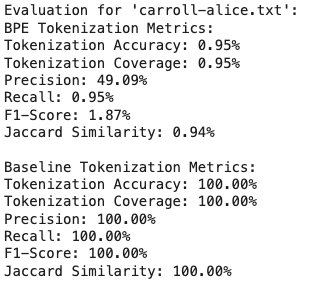

## Task 1: Implementing the BPE algo
- Create a class to implement BPE algo\
- Parameters: \
  `num_merges`: num of merges we implemented, default is 10 times \
  `bpe_merges`: merges we implemented
- Functions Used \
`get_vocab`: create a vocab from the tokenized text\
`get_stats`: calculate the frequency for pair of adjacent tokens\
`merge_vocab`: merge the most frequent pair\
`learn_bpe`: learning process\
`encode_bpe`: encode a single word\
`encode_tokens`: encode the whole tokens\

## Task 2: Train on NLTK Dataset
- Perform BPE algo on three books, we tokenized each using `word_tokenize` and convert to lowercase. Then combined into a single list
- Train BPE algo and learn the 10 merges
- Print all the results

## Task 3: Test on NLTK Dataset
- select the test books: 'carroll-alice.txt'
- for each book, using the learned BPE in task 2 to encode the tokens and print the tokens
-  when evaluating, we meansure tokenization coverage and token length statistics as suggested in the requirement.

## Task 4: Create Reference Tokenization
- The reference tokenization are stored in a dictionary 'reference_tokenizations' and then saved to a json file.

## Task 5: Compare with Standard Tokenization

## Task 6: Visualization
- we add one parameters in BytePairEncoding class, 'vocab_evolution', to track the evolution of vocab.
-  we visualize the initial and final vocabulary using bar plot
-  we then visualize the size of vocab over the number of merges
-  we last visualize the frequency of top 5 BPT merges

## Analysis:

- Strengths of BPE

BPE can handle out-of-vocabulary words by breaking them into subwords, which is particularly useful for languages with rich morphology. By merging frequent subwords, BPE reduces the size of the vocabulary compared to character-level tokenization. BPE can generalize to unseen words by leveraging learned subword units, which can improve downstream NLP tasks.
- Weaknesses of BPE

The initial performance of BPE may be lower compared to standard tokenization methods, especially with a small number of merges.\
BPE introduces additional complexity in the tokenization process, requiring the learning and application of merge rules.\
Standard metrics show lower performance for BPE compared to baseline methods, especially in terms of tokenization accuracy and coverage.
- Comparison with Standard Tokenization

Standard Tokenization: NLTK's word_tokenize method achieves perfect metrics on the test data because it directly matches the reference tokenization.
BPE Tokenization: BPE shows lower metrics in this evaluation, due to the difference in how tokens are generated.

## Potential Improvements:
We can tell that the tokens has no semantic meanings. It would be better if we preprocess it and lemmatize it.
